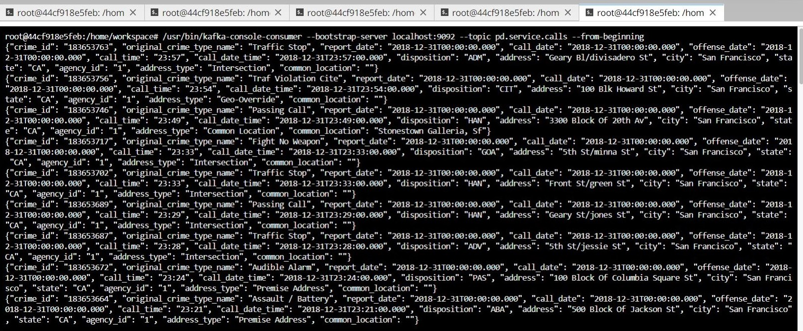
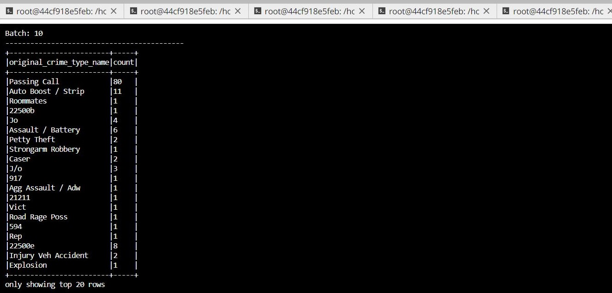
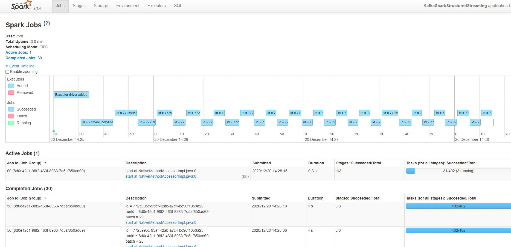

# SF Crime Statistics with Spark Streaming by Gregorio Gonzalez

## Introduction
In this project, a real-world dataset has been provided, extracted from Kaggle, on San Francisco crime incidents, and statistical analyses of the data using Apache Spark Structured Streaming need to be provided. A Kafka server will be generated to produce data and ingest it through Spark Structured Streaming.

## Resources
The files below have been included in the Project Workspace, containing three Python files that are starter code, the project dataset, and some other necessary resources.

- producer_server.py
- kafka_server.py
- data_stream.py
- police-department-calls-for-service.json
- radio_code.json
- start.sh
- requirements.txt
   
## Project Steps 
- Come up with a Kafka topic name ("pd.service.calls") and choose a port number (9092)
- Edited the files producer_server.py, data_stream.py, and kafka_server.py to complete all the "To Do" requests.
- Created consumer_server.py to check if your kafka_server.py is working properly.
- Modified the zookeeper.properties and server.properties appropriately
- Ran the project using several terminals as follow:
    - Terminal 1: Ran ./start.sh
    - Terminal 2: Ran /usr/bin/zookeeper-server-start config/zookeeper.properties
    - Terminal 3: Ran /usr/bin/kafka-server-start config/server.properties
    - Terminal 4: Ran python kafka_server.py
    - Terminal 5: Ran /usr/bin/kafka-console-consumer --bootstrap-server localhost:9092 --topic pd.service.calls --from-beginning
    - Terminal 6: Ran spark-submit --packages org.apache.spark:spark-sql-kafka-0-10_2.11:2.3.4 --master local[*] data_stream.py

## Results
The project was successfully implemented with no errors.

After running the codes from terminal 1 to 5, I was able to get the Kafka Consumer Console working. Screen capture is shown below.

##### Kafka_Consumer_Console

Additionally, after running the code in terminal 6 I was able to execute the Spark jobs and retrieve the Progress Reporter and Spark UI screens capture shown below.

##### Spark_Job_Progress_Reporter

##### Spark_Streaming_UI

    
    

## Project Questions

##### 1. How did changing values on the SparkSession property parameters affect the throughput and latency of the data?
I did compare several values of maxOffsetPerTrigger and maxRatePerPartition and it seems that the impact on the throughput and latency of the data is not much. It could be because of the data set size. However, based on the literature, very large flush intervals may lead to latency spikes when the flush does occur as there will be a lot of data to flush. Also, The flush is generally the most expensive operation, and a small flush interval may lead to excessive seeks. So, my take away is to test them with your dataset to ensure optimum values.
    
##### 2. What were the 2-3 most efficient SparkSession property key/value pairs? Through testing multiple variations on values, how can you tell these were the most optimal?
Getting the best performance out of a Spark Streaming application requires a bit of tuning. At a high level, we need to consider two things:

1. Reducing the processing time of each batch of data by efficiently using cluster resources.

2. Setting the right batch size such that the batches of data can be processed as fast as they are received (that is, data processing keeps up with the data ingestion).

As mentioned before, I didn't see major changes when making slightly different configurations. Seems to me, that MaxRatePerPartition and the MaxOffsetPerrtigger at 200 values work ok. I read in the literature that also working with Parallelism and the number of local nodes could also improve the performance. Anyhow, it's important to carefully choose them rather than accepting the default values.
    
## Resources
A few issues were encountered during the project. I search some of the Knowledge center posts and used them as appropriate.
1. Dummy data in Line not reading
https://knowledge.udacity.com/questions/369228

2. Spark UI not showing data
https://knowledge.udacity.com/questions/187420

3. Config files not running
https://knowledge.udacity.com/questions/80037

